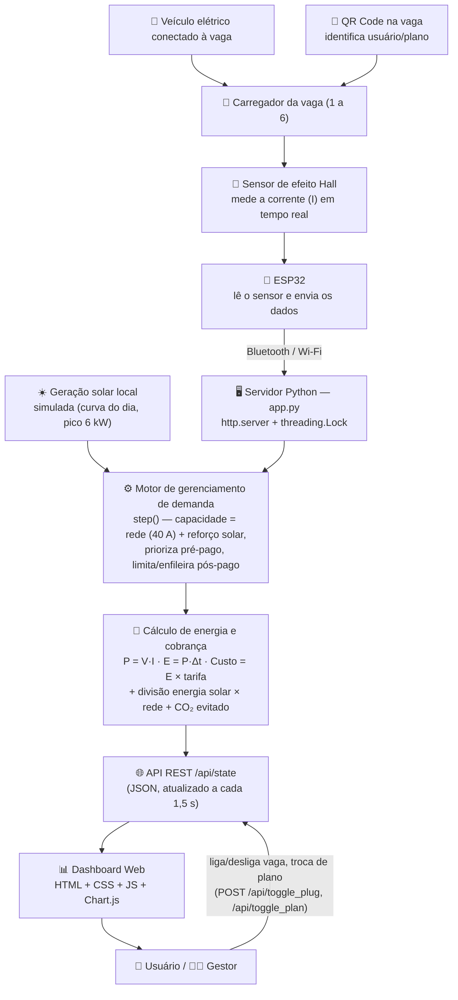

# Dashboard-V2

# ⚡ ReCarga — Dashboard de Recarga Veicular

## 👥 Integrantes

| Nome                                | RM     |
| ----------------------------------- | ------ |
| Olavo Dadario Vianna Barreto        | 569272 |
| Mateus de Oliveira Fernandes Neves  | 572431 |
| Angela Sousa Takezawa               | 570797 |
| Paulo Henrique Lira Bilac de Araujo | 569496 |
| Pedro Soares de Souza               | 571285 |
| Jhon Cutile Titirico                | 571976 |

---

## 📌 Sobre o projeto

O **ReCarga** é um protótipo de um sistema inteligente para gerenciamento de recarga de veículos elétricos. A solução foi desenvolvida pensando em ambientes que possuem diversos pontos de recarga e precisam administrar uma capacidade elétrica limitada.

Com o crescimento do número de veículos elétricos, locais como estacionamentos, empresas e condomínios podem enfrentar problemas quando vários veículos são carregados ao mesmo tempo. Uma demanda elevada pode ultrapassar a capacidade disponível da instalação, causando sobrecargas ou exigindo investimentos maiores na infraestrutura elétrica.

O ReCarga busca solucionar esse problema por meio de um sistema que gerencia a demanda de potência, distribui a capacidade disponível entre os carregadores e permite o acompanhamento das recargas através de uma interface interativa.

Além do gerenciamento de energia, o sistema também simula a cobrança das recargas de acordo com o consumo de cada veículo. Dessa forma, o projeto reúne em uma única solução o **controle da demanda elétrica, o gerenciamento inteligente das recargas e o acompanhamento dos usuários e gestores através de um dashboard**.

---

## 🎯 A solução

O sistema simula um estacionamento com diversas vagas para veículos elétricos. Cada vaga possui um carregador que pode estar ativo ou desativado e utiliza uma determinada quantidade de energia.

O ReCarga monitora constantemente a demanda dos carregadores e verifica se a capacidade máxima do sistema está sendo respeitada. Quando a demanda aumenta, o sistema distribui a energia disponível de forma inteligente, evitando que o limite seja ultrapassado.

A interface permite acompanhar informações como:

* ⚡ Corrente utilizada por cada carregador;
* 🔋 Potência consumida;
* 📊 Energia acumulada em kWh;
* 💰 Custo individual das recargas;
* 🔌 Carga total do sistema;
* 🚨 Situações de sobrecarga evitadas;
* 🅿️ Status das vagas;
* 📈 Receita acumulada.

---

## ⚡ Gerenciamento inteligente da demanda

O protótipo trabalha com uma capacidade máxima simulada de **40 A**. Todos os carregadores ativos compartilham essa capacidade.

Para tornar a simulação mais próxima de um cenário comercial, o sistema trabalha com dois tipos de plano: **pré-pago** e **pós-pago**.

### 🟢 Pré-pago

Os carregadores do plano pré-pago possuem prioridade na distribuição da capacidade disponível.

* Corrente-alvo de **16 A**;
* Preço de **R$ 1,35 por kWh**;
* Capacidade priorizada no sistema.

### 🔵 Pós-pago

Os carregadores do plano pós-pago utilizam a capacidade restante após o atendimento das demandas prioritárias.

* Corrente-alvo de **10 A**;
* Preço de **R$ 0,98 por kWh**;
* Pode ter a corrente reduzida quando a demanda está elevada;
* Pode aguardar caso não exista capacidade suficiente.

Essa lógica permite demonstrar como uma infraestrutura com recursos limitados pode gerenciar diversos veículos simultaneamente sem ultrapassar sua capacidade máxima.

---

## 💰 Sistema de cobrança

Cada recarga possui seu consumo acompanhado durante o funcionamento da simulação.

O sistema calcula a energia consumida em **kWh** e utiliza o valor do plano selecionado para calcular o custo da recarga. Dessa forma, é possível acompanhar quanto cada veículo consumiu e qual foi o valor correspondente.

A solução também registra a receita acumulada do sistema, permitindo que gestores tenham uma visão geral da operação.

Essa funcionalidade demonstra como o gerenciamento da infraestrutura de recarga pode ser combinado com um modelo de cobrança para usuários.

---

## 🖥️ Dashboard e experiência do usuário

O ReCarga possui uma interface desenvolvida para apresentar as informações do sistema de forma visual e organizada.

Através do dashboard, é possível:

* Visualizar a carga atual do sistema;
* Acompanhar o consumo dos carregadores;
* Ativar ou desativar vagas;
* Alternar o plano de uma vaga;
* Consultar o consumo de energia;
* Acompanhar o custo das recargas;
* Visualizar o status de cada carregador;
* Acompanhar a receita acumulada.

Os carregadores podem assumir diferentes estados, como **carregando**, **reservado**, **limitado**, **em fila** ou **livre**, facilitando a identificação da situação de cada vaga.

---

## 🚀 Diferenciais da solução

O ReCarga não se limita a apresentar o consumo dos veículos. O projeto combina diferentes funcionalidades em um único protótipo:

* **Distribuição inteligente da capacidade elétrica disponível**;
* **Controle para evitar sobrecargas**;
* **Priorização de diferentes tipos de usuários ou planos**;
* **Sistema de cobrança baseado no consumo**;
* **Monitoramento em tempo real**;
* **Dashboard interativo para usuários e gestores**.

A proposta foi pensada para ser aplicável em cenários reais onde a quantidade de veículos elétricos pode ser maior do que a capacidade disponível para carregamento simultâneo.

---

## 🧪 Protótipo atual

O projeto já possui uma versão funcional que pode ser executada localmente.

Atualmente, o protótipo conta com:

* Simulação de múltiplos carregadores;
* Gerenciamento da capacidade máxima;
* Controle de prioridade entre os planos;
* Cálculo de potência e energia;
* Sistema de cobrança;
* Atualização dos dados em tempo real;
* Interface interativa no navegador.

Isso permite demonstrar na prática o funcionamento da solução, indo além da ideia ou conceito inicial.

---

## 🧩 Tecnologias utilizadas

O projeto foi desenvolvido utilizando:

* **Python 3** — responsável pelo servidor, simulação (incluindo a curva de geração solar) e cálculos;
* **HTML** — estrutura da interface;
* **CSS** — organização e responsividade do dashboard;
* **JavaScript** — comunicação com o servidor e atualização dos dados, incluindo o card de geração solar;
* **Chart.js** — visualização gráfica das informações.

O projeto utiliza principalmente recursos da biblioteca padrão do Python, evitando a necessidade de instalar frameworks complexos para executar o protótipo.

---

## 📁 Estrutura do projeto

```text
Dashboard-Plano-main/
│
├── Dashboard/
│   └── app.py
│
├── template/
│   └── index.html
│
└── Static/
    ├── app.js
    └── style.css
```

---

## 🛠️ Sprint 3 — Prototipagem Funcional e Integração

Esta seção documenta o material exigido na Sprint 3: o esquema de integração dos componentes, a justificativa técnica das escolhas, os resultados/dados funcionais apresentados pelo protótipo e a conexão do projeto com os conteúdos da disciplina.

### 🎬 Vídeo técnico

O vídeo de demonstração (até 5 min), com a explicação da integração dos componentes e o protótipo em funcionamento, está disponível em:
**[link do vídeo no YouTube — inserir aqui]**

### 🔗 Esquema de integração dos componentes

O protótipo atual é **simulado em software**, mas foi desenhado para espelhar fielmente a arquitetura física planejada nas Sprints 1 e 2 (sensor de efeito Hall + ESP32 + QR Code). O diagrama de blocos abaixo mostra como cada componente se conecta e atua em conjunto, da leitura de corrente até a exibição no dashboard:



**Fluxo resumido:**

1. O veículo é conectado à vaga e identificado (no protótipo físico, via **QR Code**; no protótipo simulado, via seleção manual na interface).
2. O **sensor de efeito Hall** mede a corrente instantânea consumida pelo carregador.
3. O **ESP32** faz a leitura do sensor e transmite o valor via **Bluetooth/Wi-Fi** para o servidor.
4. Em paralelo, o módulo de **geração solar simulada** (`solar_generation_kw()`) calcula a potência solar disponível naquele instante, seguindo uma curva de "dia" (nascer → pico ao meio-dia → pôr do sol) comprimida para caber na demonstração.
5. O servidor Python (`app.py`) executa o **motor de gerenciamento de demanda** (`step()`), que soma a geração solar (convertida em corrente equivalente) à capacidade fixa da rede (40 A) e redistribui essa capacidade dinâmica entre os planos pré-pago e pós-pago — priorizando sempre o pré-pago.
6. A partir da corrente, o sistema calcula **potência (P = V·I)**, **energia acumulada (E = P·Δt)**, **custo da recarga** e também **quanto dessa energia veio do sol vs. da rede**, além do **CO₂ evitado** com o uso da energia solar.
7. Esses dados são expostos pela **API REST `/api/state`** em formato JSON.
8. O **dashboard web** consome essa API a cada 1,5 s e atualiza gráficos, indicadores, o card de geração solar e o status de cada vaga em tempo real.
9. O usuário/gestor interage de volta com o sistema (ligar/desligar vaga, trocar plano), fechando o ciclo de automação.

### 🧠 Justificativa técnica das escolhas

| Escolha | Justificativa |
| --- | --- |
| **Sensor de efeito Hall** | Permite medir corrente sem inserir resistência em série no circuito (medição não invasiva), é de baixo custo e amplamente compatível com o ADC de microcontroladores — ideal para leitura contínua de corrente em cada carregador. |
| **ESP32** | Possui Wi-Fi e Bluetooth integrados, múltiplas entradas analógicas e é de baixo custo, permitindo ler vários sensores e transmitir os dados sem hardware adicional de comunicação. |
| **QR Code por vaga** | Solução simples e de baixo custo para identificar o usuário/veículo e o plano de recarga no momento da conexão, sem exigir sistemas de autenticação complexos nesta fase do protótipo. |
| **Python + `http.server` (biblioteca padrão)** | Evita dependências externas (como Flask), simplificando a execução do protótipo em qualquer máquina com Python instalado — requisito importante para um protótipo acadêmico que precisa ser fácil de demonstrar. |
| **`threading.Lock` e `ThreadingHTTPServer`** | Garantem que a leitura e a escrita do estado compartilhado (corrente, energia, custo de cada vaga) sejam feitas de forma segura mesmo com múltiplas requisições simultâneas, evitando condições de corrida. |
| **API REST em JSON (`/api/state`)** | Desacopla o backend (simulação/leitura de dados) do frontend (dashboard), permitindo que, no futuro, o mesmo dashboard consuma dados vindos de hardware real sem alterar a interface. |
| **Chart.js** | Biblioteca leve, sem necessidade de build, com boa documentação, suficiente para exibir a evolução da receita e do consumo em tempo real. |
| **Lógica de priorização pré-pago/pós-pago** | Reproduz um cenário comercial realista de gestão de demanda: garante capacidade para quem já reservou energia (pré-pago) e usa a capacidade excedente para os demais (pós-pago), demonstrando controle inteligente de carga em vez de um simples liga/desliga. |
| **Módulo de geração solar simulada (`solar_generation_kw`)** | Modela a curva de geração de um painel solar local ao longo do dia (função seno entre nascer e pôr do sol) e soma essa potência, convertida em corrente, à capacidade fixa da rede. É essa integração que conecta explicitamente **energia renovável** e **automação** no protótipo: o motor de gerenciamento de demanda passa a decidir com base em uma capacidade que varia conforme a disponibilidade solar, e não apenas com base na rede elétrica. |

### 📊 Resultados e dados funcionais apresentados

O protótipo gera continuamente dados funcionais (reais dentro da simulação, no mesmo formato que viriam de sensores físicos), atualizados a cada **1,5 segundos** pelo motor de simulação (`step()` em `app.py`):

* **Corrente por carregador (A):** calculada a partir da corrente-alvo do plano (16 A pré-pago / 10 A pós-pago), aplicando o fator de escala de prioridade e uma variação (jitter) de ±10% para simular oscilação real da carga.
* **Potência instantânea (kW):** `P = V × I`, com tensão fixa simulada de 230 V.
* **Energia acumulada (kWh):** `E = P × Δt`, integrada a cada ciclo de simulação.
* **Custo por sessão (R$):** `Custo = E × tarifa`, com tarifas diferentes por plano (R$ 1,35/kWh pré-pago e R$ 0,98/kWh pós-pago).
* **Carga total do barramento (A):** soma da corrente de todas as vagas ativas, comparada à capacidade **dinâmica** do sistema (rede de 40 A + reforço solar do instante).
* **Eventos de sobrecarga evitados:** contador incrementado sempre que a demanda do pós-pago excede a capacidade restante e o sistema precisa limitar/enfileirar carregadores.
* **Receita acumulada (R$):** soma do custo de todas as vagas, separada por plano e plotada em um gráfico de série temporal (últimas 40 amostras).
* **Status de cada vaga:** `carregando`, `reservado`, `limitado`, `em fila` ou `livre`, refletindo em tempo real a decisão do algoritmo de gerenciamento de demanda.
* **Potência solar disponível (kW):** calculada por `solar_generation_kw()`, seguindo uma curva de dia simulado (0 kW à noite, pico de 6 kW ao "meio-dia").
* **Reforço de capacidade vindo do sol (A):** quantos ampères a mais o barramento tem disponível naquele instante graças à geração solar — exibido em tempo real no card "☀️ Geração solar local" e somado à barra de carga do barramento.
* **Energia solar × energia de rede (kWh):** o consumo de cada vaga é dividido, a cada ciclo, entre o que veio da geração solar e o que veio da rede, mostrando a participação renovável na matriz de recarga.
* **CO₂ evitado (kg, estimado):** energia solar consumida multiplicada por um fator médio de emissão da rede elétrica (valor ilustrativo), demonstrando o benefício ambiental da integração renovável.
* **Sobrecargas evitadas graças ao reforço solar:** contador separado que mostra quantas vezes a geração solar permitiu atender à demanda do pós-pago sem limitar/enfileirar, algo que aconteceria se o sistema dependesse só da rede.

Esses dados podem ser conferidos ao vivo em `http://localhost:5000` e são os mesmos exibidos no vídeo de demonstração da Sprint 3.

### 🎓 Conexão com os conteúdos da disciplina

* **Sinergia entre energia renovável e automação (foco da Sprint 3):** o motor de gerenciamento de demanda (`step()`) não decide mais só com base na rede elétrica — ele soma a geração solar simulada à capacidade da rede a cada ciclo e redistribui automaticamente essa capacidade dinâmica entre pré-pago e pós-pago. É essa integração (fonte renovável alimentando diretamente a lógica de automação) que conecta os dois pilares pedidos no enunciado, e não apenas os dois existindo lado a lado no texto.
* **Eficiência energética e automação inteligente:** o mesmo algoritmo atua como uma malha de controle automática, redistribuindo a corrente disponível entre os carregadores sem intervenção humana, sempre respeitando o limite físico do barramento — o mesmo princípio usado em sistemas de gerenciamento de energia (EMS) reais.
* **Sustentabilidade e energia renovável:** ao usar a geração solar para reforçar a capacidade disponível (em vez de superdimensionar a rede), o sistema reduz o consumo de energia de origem não-renovável e evita emissões — quantificado no protótipo pelos indicadores de energia solar acumulada e CO₂ evitado.
* **Sistemas embarcados e IoT:** a arquitetura proposta (sensor de efeito Hall → ESP32 → comunicação sem fio → servidor) segue o modelo clássico de um sistema IoT de monitoramento de energia, tema diretamente ligado aos conteúdos de automação e integração de dispositivos vistos na disciplina.
* **Modelagem matemática aplicada:** as fórmulas de potência (`P = V·I`), energia (`E = P·Δt`) e custo (`Custo = E × tarifa`), além da curva de geração solar (`P_solar = P_pico · sen(π · fração_do_dia)`), exibidas em tempo real no próprio dashboard, conectam diretamente os conceitos elétricos da disciplina com sua aplicação prática no protótipo.

---

## ⚙️ Como executar

### 1. Abra o projeto no VS Code

Após extrair o projeto, abra a pasta principal no VS Code.

### 2. Execute o servidor

Abra o arquivo `app.py` e execute o programa utilizando o botão **Run Python File** ou pelo terminal.

```bash
python app.py
```

Caso necessário:

```bash
python3 app.py
```

### 3. Acesse o dashboard

Com o servidor em execução, abra o navegador no endereço:

```text
http://localhost:5000
```

---

## 🔮 Próximos passos

Apesar de o projeto atual ser uma simulação, a proposta pode evoluir para uma aplicação conectada a uma infraestrutura real.

A geração solar já está integrada à lógica de automação (de forma simulada); os próximos passos tratam de levar isso para hardware real:

* Substituir a curva solar simulada por leitura real de um painel fotovoltaico (sensor de corrente/tensão dedicado);
* Integração com carregadores reais;
* Leitura de dados através de sensores físicos (efeito Hall);
* Integração com dispositivos como ESP32;
* Autenticação de usuários;
* Histórico de recargas;
* Banco de dados;
* Sistema de pagamentos;
* Aplicação mobile;
* Comunicação segura com os carregadores.

Uma possível evolução da arquitetura seria:

```text
Sensores / Carregadores
          ↓
       ESP32
          ↓
Comunicação com o servidor
          ↓
Gerenciamento da demanda
          ↓
Cálculo de consumo e cobrança
          ↓
Dashboard para usuários e gestores
```

---

## 💡 Conclusão

O **ReCarga** apresenta uma proposta para tornar o gerenciamento de recarga de veículos elétricos mais eficiente e organizado.

Por meio da distribuição inteligente da potência, do acompanhamento do consumo e de um sistema de cobrança integrado, o projeto demonstra como diferentes aspectos da infraestrutura de recarga podem ser administrados em conjunto.

O protótipo atual representa uma base funcional que pode ser evoluída para aplicações em ambientes comerciais, oferecendo benefícios tanto para os gestores da infraestrutura quanto para os usuários dos veículos elétricos.

**Frontend:** HTML + CSS + JavaScript  
**Gráficos:** Chart.js  
**Servidor:** `http.server`  
**Dependências Python externas:** Nenhuma
